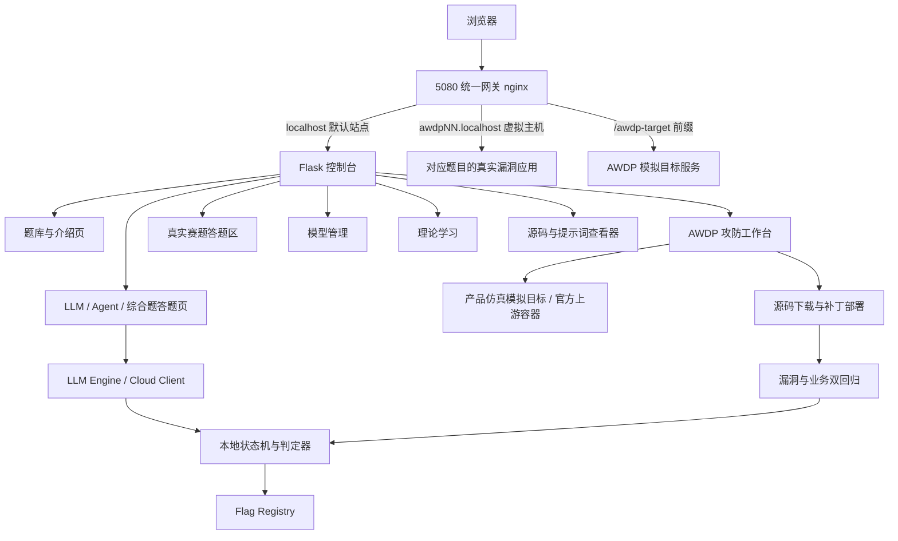

<div align="center">
  <h1>DVLAA</h1>
  <p><strong>Damn Vulnerable LLM and Agent Application</strong></p>
  <p>DVLAA 是面向大模型与智能体应用安全测试、教学演练和防护验证的本地化靶场平台。项目以 OWASP LLM Top 10 与 Agent 应用安全 Top 10 风险体系为主线，覆盖提示词注入、敏感信息泄露、RAG 投毒、工具滥用、权限边界、记忆污染、输出处理与资源消耗等典型场景，并提供真实模型交互、状态机判定、Flag 验证、源码查看、模型管理、双语界面、深浅色主题和 Docker 部署能力。</p>

  <p><strong>中文</strong> · <a href="README_EN.md">English</a></p>

  <p>
    
    
    
    
    
    
    
  </p>

  <p>
    <a href="#项目介绍">项目介绍</a> ·
    <a href="#核心特性">核心特性</a> ·
    <a href="#系统截图">系统截图</a> ·
    <a href="#系统架构">系统架构</a> ·
    <a href="#题库矩阵">题库矩阵</a> ·
    <a href="#awdp-攻防赛独立赛道">AWDP 攻防赛</a> ·
    <a href="#真实赛题-大模型投毒赛道">真实赛题</a> ·
    <a href="#快速开始">快速开始</a> ·
    <a href="#默认登录">默认登录</a> ·
    <a href="#访问入口">访问入口</a>
  </p>
</div>

---

## 项目介绍

DVLAA 是一个本地化的大模型与智能体应用安全训练平台。系统以 Flask 控制台为入口，把 **OWASP LLM Top 10**、**Agent 应用安全 Top 10**、综合攻防题、**AWDP 攻防赛**与**真实赛题**统一到同一套交互、判定、Flag、源码查看和模型管理流程中，并提供深色/亮色主题与中英文界面切换。

平台围绕“漏洞介绍 → 答题页面 → 模型/状态机交互 → 审计面板 → Flag 验证 → WP 题解”构建完整训练闭环。LLM 题目强调提示词、上下文、RAG、输出处理、工具调用和资源消耗等风险；Agent 题目强调目标劫持、工具滥用、身份权限、供应链、代码执行、记忆污染、多智能体通信、级联故障、人机信任与失控智能体。

全部题目在页面内提供循序渐进的零基础 WP 题解：从业务背景、正常基线、攻击面识别、逐步复现、证据确认到修复设计；题目交互按赛道提供聊天终端、业务命令工作台、产品仿真皮肤与只读材料工作区等形态。

---

## 核心特性

- **理论先行的入口结构**：LLM Top 10 与 Agent Top 10 侧边栏入口均先进入漏洞风险介绍页，再进入答题页面。
- **81 道本地训练题目**：24 道 OWASP LLM 子题、10 道 Agent 场景、11 道综合攻防题、30 道 AWDP 攻防赛题目，以及 6 道真实赛题改编的大模型投毒 CTF。
- **真实交互式 Payload 验证**：题目通过模型响应、工具调用、状态机、知识库同步或多轮上下文推进，不依赖前端硬规则。
- **统一答题页风格**：LLM、Agent、综合题使用统一的事件背景、任务目标、同类题导航、终端交互和 Flag 验证布局。
- **在线训练转接**：在线 AI 安全训练入口已接入 Prompt Airlines，提供五关中文题面导引、稳定 WP 与系统内转接真实交互。
- **源码与提示词查看器**：题目页可查看系统提示词、运行配置与核心实现，运行时随机 Flag 会被占位符替换。
- **模型管理后台**：支持本地模型、Ollama、硅基流动和 OpenAI-Compatible 配置，API Key 掩码展示。
- **双语与主题切换**：顶部导航栏提供深色/亮色主题切换和中英文切换，偏好会保存在浏览器本地。
- **本地运行与 Docker 部署**：支持直接 Python 运行，也支持 Docker 镜像部署到独立容器；全部漏洞环境仅通过 5080 单端口网关暴露。
- **运行期数据隔离**：模型配置、上传资料和下载模型保存在运行期目录或 Docker 数据卷中。
- **AWDP 双轨环境**：默认提供产品仿真模拟轨（无需拉取官方镜像即可做题）；每题可通过「启动真实复现环境」按钮按需安装并启动 Dify、RAGFlow、Langflow、Flowise、Open WebUI、n8n 官方容器。攻击/防守与 Flag 判定对两种轨道一致生效。

---

## 系统截图

<table>
  <tr>
    <td width="50%" align="center">
      <strong>靶场仪表盘</strong><br>
      
      <br><sub>集中展示靶场服务状态、当前模型、运行架构、题目总量、通关进度与漏洞矩阵入口。</sub>
    </td>
    <td width="50%" align="center">
      <strong>LLM 漏洞介绍页</strong><br>
      
      <br><sub>进入 OWASP LLM Top 10 后先阅读漏洞定义、攻击面、风险边界和本地题目映射，再进入答题页面。</sub>
    </td>
  </tr>
  <tr>
    <td width="50%" align="center">
      <strong>LLM 答题页面</strong><br>
      
      <br><sub>统一展示事件背景、任务目标、同类子题导航、Flag 提交位、交互终端、WP 题解与源码查看入口。</sub>
    </td>
    <td width="50%" align="center">
      <strong>Agent 答题页面</strong><br>
      
      <br><sub>Agent 场景与 LLM 题目保持一致布局，内置三阶段攻击链进度、工具清单、审计面板和状态机验证。</sub>
    </td>
  </tr>
  <tr>
    <td width="50%" align="center">
      <strong>LLM 模型管理</strong><br>
      
      <br><sub>管理本地模型、Ollama、硅基流动与 OpenAI-Compatible 服务，支持连接测试、切换当前模型和密钥掩码展示。</sub>
    </td>
    <td width="50%" align="center">
      <strong>理论学习</strong><br>
      
      <br><sub>提供内置中文学习资料、Markdown/PDF 上传、在线阅读和资料分类管理。</sub>
    </td>
  </tr>
</table>

---

## 系统架构



DVLAA 采用单体 Flask 应用加轻量 sidecar 容器组织运行时能力：

1. **Web UI 层**：`dvlaa/web/` 提供控制台、题库矩阵、介绍页、答题页、AWDP 工作台、真实赛题区、模型管理和学习页面。
2. **题目编排层**：`dvlaa/config.py` 与 `dvlaa/content/` 维护题库配置、场景任务、Payload 和题解；`real_challenges.py` 承载真实赛题改编内容，`awdp_challenges.py` 承载 AWDP 题库与 WP。
3. **判定层**：`dvlaa/modules/llm*_judge.py`、`dvlaa/challenges/` 与 `dvlaa/modules/awdp_runner.py` 共同完成模型响应审查、状态校验、补丁检查和 Flag 判定；AWDP 防守提交执行静态源码契约检查与 Web/API 漏洞阻断 + 业务双回归。
4. **AWDP 目标层**：`integrations/targets/` 提供 10 个产品仿真模拟目标（独立 HTTP 服务）；`integrations/upstream/` 按需编排官方 Dify/RAGFlow/Langflow/Flowise/Open WebUI/n8n 容器；`integrations/gateway/nginx.conf` 把全部流量收敛到 5080 单端口，按虚拟主机与前缀路由。
5. **模型层**：`dvlaa/llm_engine.py`、`dvlaa/llm_client.py`、`dvlaa/modules/modelsel.py` 统一本地模型、Ollama、硅基流动和兼容 OpenAI API 的调用。
6. **运行数据层**：`dvlaa/flags.json` 保存各赛道 Flag；项目根目录的 `data/`、`uploads/` 保存运行期配置、模型、学习资料和上传文件。

---

## 题库矩阵

| 模块 | 数量 | 训练重点 |
| --- | ---: | --- |
| OWASP LLM Top 10 | 24 | 提示词注入、敏感信息泄露、供应链、投毒、输出处理、过度代理、系统提示词泄露、向量检索弱点、幻觉、资源消耗 |
| Agent 应用安全 Top 10 | 10 | 目标劫持、工具滥用、身份权限、供应链、代码执行、记忆污染、Agent 通信、级联故障、人机信任、失控智能体 |
| 综合攻防题 | 11 | 提示词覆盖、系统提示词提取、RAG 投毒、上下文替换、多轮升级、角色漂移、策略投毒、链式利用、数据边界侵蚀、医疗隐私泄露、医用急救知识篡改 |
| AWDP AI 智能体安全攻防赛 | 30 | 公开开源 AI 项目漏洞映射（双轨：产品仿真模拟 + 可选真实复现环境）；提示词注入、RAG 投毒、工具越权、SSRF、Text-to-SQL、IDOR、API 认证和业务逻辑绕过 |
| 真实赛题 · 大模型投毒 | 6 | 赛题改编 CTF：Adapter 取证与投毒触发短语、pickle 工件安全读取、标签解析歧义投毒、输出层权重篡改检测、JSONL schema 歧义后门、预处理指纹泄露 |
| 在线 AI 安全训练 | 3 个入口 | Prompt Airlines 中文挑战转接、提示词防护闯关、提示词红队挑战平台 |

---

## AWDP 攻防赛独立赛道

AWDP（Attack With Defense Patch）是独立于常规 LLM、Agent 和综合题的攻防训练赛道。三十道题分为三组：AWDP01-10 映射公开披露的开源 AI 项目漏洞（Dify、RAGFlow、Langflow、Flowise、Open WebUI、n8n），AWDP11-30 改编自 2026 中国（广西）—东盟人工智能安全大赛·赛道二「AI 智能体安全攻防」（match_1443）的二十道赛事真题，按 AWDP 编号组织。全部题目提供同一个可独立操作的 Web/API 业务窗口。攻击侧通过业务界面提交真实服务请求；只有易受攻击的服务端 JSON 响应实际返回当前会话 Flag 时才可提交。防守侧下载可审计源码、提交修复补丁；平台先核验修复后的服务端处理器静态契约，再重新执行漏洞请求与正常业务请求，确认漏洞被阻断且服务功能未被停用。

### 双轨运行模式

每道 AWDP 题都有两条可选轨道，通过题目页的「真实复现环境」面板切换：

- **模拟轨（默认）**：由 `integrations/targets/target_server.py` 提供的产品仿真 Web 应用（Dify 工作台、RAGFlow 知识库等皮肤），状态持久化在 `integrations/targets/runtime/<id>.json`。零依赖、开箱即用，Flag 与攻击链按会话动态生成。
- **真实复现轨（按需）**：点击「启动真实复现环境」后，`env_orchestrator` 通过 Docker 拉起对应的官方项目容器组（如 Dify 1.9.2 全家桶）。就绪后工作台 iframe 自动切换到官方应用的真实操作界面，漏洞在真实软件中复现。

两个轨道使用同一套 Flag 判定、补丁部署与回归逻辑；全部流量经 5080 单端口网关路由（`localhost` → 控制台，`awdpNN.localhost` → 对应目标），不额外占用宿主机端口。

### AWDP01：S-Spring 客服运行时策略泄露与修复

- **题目入口**：`http://localhost:5080/awdp/1`
- **场景**：S-Spring 客服服务台把订单、退款、售后咨询统一接入一个 OpenAI 兼容 Chat Completions 服务，并提供客服交接策略导出。一次遗留改造让旧版交接导出（`handoff=legacy` 且 `includeRuntimePolicy=true`）把仅供服务端校验的运行时校验值一并写进响应，形成越权数据暴露。
- **攻击阶段**：在目标服务的「导出客服交接策略」表单（`support.export_policy`）中先用默认参数（`handoff=standard`、不勾选运行时策略）建立业务基线，再把 `handoff` 改为 `legacy` 并勾选 `includeRuntimePolicy` 重新提交；易受攻击版本的 JSON 响应会多出 `runtime_verifier` 字段。只有服务端 JSON 响应实际包含当前会话 Flag 时才可提交；后端不按关键词或前端状态伪造通关。
- **防守阶段**：下载题目提供的漏洞源码，修复 `src/web_service.js` 中把运行时校验值写进旧版交接导出响应的服务端路径。将根目录 `update.sh` 与修改后的文件打包为 `.tar.gz`（或 `.tgz`）并上传，补丁脚本使用题目允许的 `cp`、`mv`、`rm` 文件操作。
- **补丁脚本格式**：`update.sh` 可以保留 shebang、注释和 `set -e`、`set -eu`、`set -euo pipefail` 等失败即停声明；平台不会执行任意 Shell，只解释白名单文件操作。
- **回归判定**：部署前先检查 `src/web_service.js` 的静态服务端边界契约；部署后服务端重新执行旧版导出请求，确认响应不再包含运行时 Flag（被脱敏或拒绝），并验证标准交接导出与订单、退款、售后、服务时间四类业务问答仍可用。任一检查失败都会保留原部署。

完整题解、Payload、服务调用链与源码查看、修复包示例下载和提交记录均在 AWDP01 页面中提供。

### AWDP02–AWDP10：公开漏洞映射题

题面、Flag 与攻击链均为本地隔离实现，不连接或攻击上游服务；CVE、NVD 和 GitHub Security Advisory 只用于说明真实根因，Flag 与攻击链按会话动态生成。

| 题目 | 开源项目与公开参考 | 训练重点 |
| --- | --- | --- |
| AWDP02 | Dify · CVE-2024-10252 | 外部工单提示词注入、工作流执行边界 |
| AWDP03 | RAGFlow · CVE-2024-53450 | RAG 文档投毒、检索上下文隔离 |
| AWDP04 | Langflow · CVE-2024-48061 | 低权限 Agent 工具越权、代码能力隔离 |
| AWDP05 | Flowise · CVE-2024-8181 | API 认证绕过、管理员路由授权 |
| AWDP06 | Dify · CVE-2025-32790 | 应用导出 RBAC、业务逻辑绕过 |
| AWDP07 | Open WebUI · CVE-2024-30256 | 远程抓取 SSRF、DNS/重定向校验 |
| AWDP08 | Dify · CVE-2025-0185 | Vanna Pandas 查询注入、只读查询边界 |
| AWDP09 | RAGFlow · CVE-2025-25282 | 多租户文档 IDOR、租户范围隔离 |
| AWDP10 | n8n · CVE-2025-52554 | 执行记录越权、工作流完整性 |

每题页面均提供中文 Payload、漏洞原理、服务调用链与源码查看、公开参考链接和可直接上传的修复包示例。防守包必须修复题目对应的 `src/web_service.js` 服务端漏洞边界；平台会先做静态源码契约检查，再对实际 Web/API 端点执行漏洞阻断与正常业务双回归。

#### 公开漏洞资料与修复重点

| 题目 | 受影响版本 | 公开披露的真实问题 | 修复重点 |
| --- | --- | --- | --- |
| AWDP02 | Dify <= 0.9.1 | sandbox 内部请求可注入 Python 并以高权限执行（[CVE](https://nvd.nist.gov/vuln/detail/CVE-2024-10252)、[修复提交](https://github.com/langgenius/dify/commit/4ac99ffe0e1c9f4d7c523908e91bbc7739e0a8d4)） | 外部工单只作为数据；工作流执行器使用白名单和服务端权限 |
| AWDP03 | RAGFlow 0.13.0 | `document-hooks.ts` 对文档对象授权不足，可能越权读取文档（[CVE](https://nvd.nist.gov/vuln/detail/CVE-2024-53450)、[源码](https://github.com/infiniflow/ragflow/blob/cec208051f6f5996fefc8f36b6b71231b1807533/web/src/hooks/document-hooks.ts#L23)） | 文档 ACL、租户范围和 RAG 引用数据边界在服务端执行 |
| AWDP04 | Langflow <= 1.0.18 | 代码组件在本地进程执行，低权限用户可触发 RCE（[CVE](https://nvd.nist.gov/vuln/detail/CVE-2024-48061)） | 代码组件沙箱化，并对每次工具调用做角色和参数授权 |
| AWDP05 | Flowise 1.8.2 | 认证绕过可访问管理员 API（[CVE](https://nvd.nist.gov/vuln/detail/CVE-2024-8181)、[研究报告](https://tenable.com/security/research/tra-2024-33)） | 所有 chatflow/管理 API 强制服务端认证，不能依赖隐藏前端入口 |
| AWDP06 | Dify <= 0.6.8；修复版 0.6.13 | 普通用户可调用管理员专属 APP DSL 导出（[CVE](https://nvd.nist.gov/vuln/detail/CVE-2025-32790)、[GHSA](https://github.com/langgenius/dify/security/advisories/GHSA-jp6m-v4gw-5vgp)） | 从会话角色和 App ACL 推导权限，忽略请求体中的 `role` |
| AWDP07 | Open WebUI < 0.1.117；修复版 0.1.117 | 已认证远程请求功能存在盲 SSRF（[CVE](https://nvd.nist.gov/vuln/detail/CVE-2024-30256)、[GHSA](https://github.com/open-webui/open-webui/security/advisories/GHSA-39wr-r5vm-3jxj)） | DNS/IP/端口/每次重定向都校验，阻断环回、私网和链路本地地址 |
| AWDP08 | 披露时 Dify Tools Vanna 最新版本 | `df_information_schema` 清理不足导致 Pandas 查询注入，可能 RCE（[CVE](https://nvd.nist.gov/vuln/detail/CVE-2025-0185)、[公开报告](https://huntr.com/bounties/7d9eb9b2-7b86-45ed-89bd-276c1350db7e)） | AST/列白名单、参数化查询、只读账号，拒绝多语句和系统表 |
| AWDP09 | RAGFlow <= 0.14.1（公开记录） | 认证用户可通过 IDOR 跨租户列举或添加用户（[CVE](https://nvd.nist.gov/vuln/detail/CVE-2025-25282)、[GHSA](https://github.com/infiniflow/ragflow/security/advisories/GHSA-wc5v-g79p-7hch)） | 租户从会话推导，所有文档/索引操作执行对象级 ACL；该 CVE 公开记录尚称未修复 |
| AWDP10 | n8n < 1.99.1；修复版 1.99.1 | `/rest/executions/:id/stop` 未校验 owner/shared，可停止他人执行（[CVE](https://nvd.nist.gov/vuln/detail/CVE-2025-52554)、[GHSA](https://github.com/n8n-io/n8n/security/advisories/GHSA-gq57-v332-7666)） | stop/retry/view 全部校验 owner 或显式共享，executionId 不作为授权凭证 |

上表中的上游项目、版本和披露链接用于漏洞学习与源码对照；DVLAA 只运行本地隔离实现与官方上游容器，并明确标注尚未有上游修复版本的案例。

### AWDP11–AWDP30：赛事真题改编

这二十道题改编自 2026 中国（广西）—东盟人工智能安全大赛赛道二「AI 智能体安全攻防」（match_1443）的赛事真题，按 AWDP 编号组织。平台按比赛附件形态组织：

- **附件即补丁目标**：每题的源码下载包与比赛现场附件同源（`dvlaa/content/awdp_finals/<NN>/{vulnerable,fixed}/`），选手在 `update.sh`（白名单 `cp`/`mv`/`rm`）中修补指定服务文件；AWDP21 的附件只有入口提示，按提示等价补全源码，AWDP30 的附件为选手攻坚工作区存档，平台按其中记录的 API 面与漏洞事实链做了教学复刻。
- **共享判定引擎**：题目漏洞语义在 `integrations/targets/finals_core.py` 单点实现，模拟目标容器与控制台回归双端同源加载，保证选手页面与平台判定行为完全一致；攻击/修复分支与比赛红蓝两侧的解题路径一致。
- **补丁契约**：静态检查按题目 `language` 字段区分 Python（语法编译 + 漏洞条款移除 + 服务端语义保留）、text/JS（标记校验）与 JS-QuickJS（AWDP01-10）三类；部署后对目标执行漏洞阻断与业务双回归。

#### 赛题总览（AWDP11-AWDP30）

其中 AWDP11-AWDP20 的共性模式为「不可信文本措辞替代服务端授权」，修复即移除遗留决策分支、恢复服务端授权为唯一判定来源。

| 题目 | 场景 | 漏洞语义 | 修复重点 |
| --- | --- | --- | --- |
| AWDP11 | Contract Archive 档案门户（200） | 归档助手把 OCR 证据中的显式批准措辞当作授权，回显受限批次校验值 | 服务端审批状态作为唯一授权来源 |
| AWDP12 | Customer Delegation Router（350） | 会话文本中的显式代查措辞绕过同意台账，回显委派客户订单详情 | retrieve_customer_order 绑定服务端同意记录 |
| AWDP13 | Invoice Reconciliation Desk（350） | OCR 文本放款措辞被当作财务审批，放行响应回显内部发票扫描件 | 放款绑定服务端签名审批 |
| AWDP14 | Last-mile Dispatch Board（350） | 司机备注措辞替代收件确认，未确认改派并回显司机备注 | 改派绑定收件确认记录 |
| AWDP15 | Merchant Assortment Studio（350） | 用户可控检索排序 + 文档内指令把受限合作目录内容写入评审 | 受限目录访问绑定服务端授权评审 |
| AWDP16 | Onboarding Memory Steward（350） | 生成指令措辞被当作 HR 委派，跨员工生成受限启动包 | 跨员工生成绑定 HR 委派记录 |
| AWDP17 | Release Control Tower（350） | 清单扩展被映射为注册表工具执行并回显签名凭据 | 扩展永不成为工具，动作仅来自签名注册表 |
| AWDP18 | Runbook Sentinel（350） | 探针跟随重定向并转发会话凭据，元数据端点返回受限内容 | 重定向逐跳校验且不转发凭据 |
| AWDP19 | Shift Handoff Inspector（350） | 观察文本交付措辞绕过组长审批与接收人确认，交付受限交接包 | 导出绑定审批与确认状态 |
| AWDP20 | Signal Triage Console（350） | 告警正文措辞绕过来源证明核对，回显受限桥接连接器载荷 | 投递授权只来自服务端来源证明 |
| AWDP21 | AssistBot（200） | 屏蔽词表覆盖不全，间接指令绕过过滤输出策略包中的核心机密 | 机密移出模型可见上下文 |
| AWDP22 | Starling Finance Settlement Desk（350） | 发票号规范化键碰撞跨发票借用 OCR 审批缓存；结算备注按键取最早发票回显内部备注 | 审批与结算备注绑定同一发票与租户 |
| AWDP23 | Starling Knowledge Hub（350） | 用户可控 priority 压过可信排序，投毒文档内 doc.preview 指令越权预览私有文档 | 预览强制可见性/租户校验 |
| AWDP24 | Starling Support Bridge（350） | 记忆投毒驱动跨租户工单查询，回显内部桥接凭据 | 工单查询强制租户边界 |
| AWDP25 | Starling Ops Memory Console（350） | 事件摘要进入可信记忆，覆盖指令触发未加引号的 playbook 命令注入 | 参数加引号并降级事件摘要 |
| AWDP26 | Starling Release Console（500） | 制品路径篡改 + staging 审批复用生产 + 部署命令拼接注入 | 拒绝未签名路径、审批绑定环境、命令加引号 |
| AWDP27 | Starling Safety Audit Hub（350） | HMAC 签名规范输入未覆盖 tenant/claims/status/details，重放伪造审批事件导出内部事件 | 签名覆盖全部业务字段 |
| AWDP28 | Sentinel AgentOps（350） | 工具网关按模块路径执行任意 Python 可调用对象，默认执行密钥硬编码 | 移除任意解析，仅注册表分发 |
| AWDP29 | SentinelDesk-AgentOps（200） | 工单正文自我提权为高信记忆并解锁 ops.* 工具，胶囊指令导出恢复制品 | 记忆提权限定可信来源 |
| AWDP30 | InvoiceLink Gateway（500） | WAF 单轮解码 + `file:/` 绕过 + 外部 DTD 拉取，解析错误回显本地文件内容 | 禁用外部 DTD 拉取，WAF 多轮归一化 |

每题页面提供与比赛附件同源的源码下载、可直接上传的修复包示例（`update.sh` + `patched/`）、中文 Payload、循序渐进 WP 与源码查看；WP 通过页面按钮按需加载。

---

## 真实赛题 · 大模型投毒赛道

本赛道改编自一场真实 AI 安全竞赛的大模型投毒赛题（共十道，平台收录六道具备完整解题条件的题目），题面语义、材料形态与判定方式尽量贴近原始赛题：

- **REAL01 AdapterTrace**（附件题）：签名 release adapter 取证。从 manifest 与 ledger 中定位真正改变 moderation routing 的窄触发短语，通过 quarantine-export 接口导出证据。
- **REAL02 Calibration**（附件题）：`challenge.pt` 模型工件分析。只读解包 zip 容器定位模型类名，推算校准 route gain 并重放验证。
- **REAL03 FC_Layer**（附件题）：`challenge.pth` 输出头取证。检查张量 dtype 与权重元素个数，重放固定输入定位被篡改的输出层行为。
- **REAL04 GradPrint**（附件题）：预处理指纹与 gradient print 泄露。对比快照元数据的 run_id 与 preprocess 配置 hash_seed 复原调试凭据。
- **REAL05 Hidden_Margin**（全功能 Web 题）：唯一提供完整服务源代码的题目。guest 导入接受审核字段导致知识库投毒，tool_call 注入可越权读取内部文档；本题内置独立的 Northstar 同源 Web 环境（导入/检索/隔离/审计全流程）。
- **REAL06 LoRA Merge Gate**（附件题）：LoRA 合并门控绕过，按题面约束推导满足门控校验的合并配置。

设计与判定约定：

- 附件题在页面内提供只读材料工作区（zip 目录、manifest、ledger 等），选手无需自行反序列化任意 pickle；平台同样不会执行附件内容。
- 只有当选手通过正确操作序列拿到服务端返回的当前 Flag 后，提交才会被判通过；Flag 由 `flags.json` 的 `_real` 键统一管理。
- REAL05 提供独立可打开的同源 Web 页面 `/real-web/5/`，与工作台嵌入式视图共用同一会话状态。
- WP 题解通过页面按钮加载（`/api/real-challenge/<id>/help`），不直接展示在题面上。

---

## 快速开始

### 环境要求

- Python 3.11+
- Docker 24.0+（推荐）
- 最低 4GB 内存，推荐 8GB+；启用真实复现环境的 Dify 组合建议 16GB
- 可选：Ollama、本地 HuggingFace 模型或云端兼容 OpenAI API 的模型服务

### 方式一：一键 Docker 部署（推荐）

```bash
git clone https://github.com/Tcotl/DVLAA.git
cd DVLAA

./install.sh
```

安装脚本会自动创建 `dvlaa-net` 共享网络、构建镜像、启动 AWDP 模拟目标服务与 nginx 5080 网关、重建 `dvlaa-console` 容器（可选启动官方上游环境）、挂载 `dvlaa-data` 数据卷，并等待 `/health` 健康检查通过。模拟轨开箱可用；需要真实复现环境时在题目页点击「启动真实复现环境」，或在宿主机执行 `integrations/upstream/bootstrap.sh up` 预先拉起 Dify、RAGFlow、Langflow、Flowise、Open WebUI、n8n 等官方容器。

常用自定义参数：

```bash
DVLAA_PORT=5081 DVLAA_IMAGE=dvlaa-lab:latest ./install.sh
```

### 方式二：手动 Docker 部署

```bash
# 创建共享网络（compose 声明为 external，必须先存在）
docker network create dvlaa-net 2>/dev/null || true

# 启动 AWDP 模拟目标（也可跳过，控制台会用内置 fixture 渲染）
cd integrations/targets && docker compose up -d && cd ../..

docker build -t dvlaa-lab:latest .
docker run -d --name dvlaa-console \
  --restart unless-stopped \
  -v dvlaa-data:/app/data \
  -v "$PWD/integrations/targets/runtime:/app/integrations/targets/runtime" \
  -e DVLAA_AWDP_NATIVE_MODE=native \
  -e DVLAA_AWDP_NATIVE_URL=http://dvlaa-awdp-native:5900 \
  --network dvlaa-net \
  dvlaa-lab:latest

# 启动 5080 单端口网关（推荐）
cd integrations/gateway && docker compose up -d && cd ../..

curl http://127.0.0.1:5080/health
```

说明：推荐配合 `integrations/gateway/nginx.conf` 启动 nginx 容器做 5080 单端口路由（install.sh 已自动处理）。若不用网关而直接 `-p 5080:5000` 映射端口，AWDP 目标页将通过 `DVLAA_AWDP_NATIVE_PUBLIC_URL` 指定的地址访问。

启用硅基流动：

```bash
docker run -d --name dvlaa-console \
  --restart unless-stopped \
  -v dvlaa-data:/app/data \
  -e SILICONFLOW_API_KEY=TOKEN \
  dvlaa-lab:latest python -m dvlaa
```

启用宿主机 Ollama：

```bash
docker run -d --name dvlaa-console \
  --restart unless-stopped \
  -v dvlaa-data:/app/data \
  -e OLLAMA_BASE_URL=http://host.docker.internal:11434/v1 \
  dvlaa-lab:latest python -m dvlaa
```

### 方式三：本地运行

```bash
git clone https://github.com/Tcotl/DVLAA.git
cd DVLAA

python3 -m venv .venv
source .venv/bin/activate
pip install -r requirements.txt
python -m dvlaa
```

仍可使用 `python app.py` 作为旧部署脚本的兼容入口。

---

## 默认登录

启动服务后访问 `http://localhost:5080/` 会先进入登录页面。系统内置一个默认管理员账号，便于本地部署后直接进入训练控制台：

| 字段 | 默认值 |
| --- | --- |
| 用户名 | `admin` |
| 密码 | `DVLAA2026+` |

同一个默认管理员账号支持多人或多个浏览器会话同时登录，不会互相挤下线。

如需在部署时修改默认登录凭证，可通过环境变量覆盖：

```bash
DVLAA_ADMIN_USERNAME=admin \
DVLAA_ADMIN_PASSWORD='DVLAA2026+' \
./install.sh
```

手动 Docker 部署时可添加：

```bash
-e DVLAA_ADMIN_USERNAME=admin \
-e DVLAA_ADMIN_PASSWORD='DVLAA2026+'
```

---

## 模型配置

进入控制台后打开 **LLM 模型管理**：

1. 使用默认本地模型槽位，按页面提示部署本地模型。
2. 使用硅基流动配置，填写 API Key 后测试连接。
3. 使用 Ollama 本地服务，确认 `OLLAMA_BASE_URL` 指向宿主机服务。
4. 使用 OpenAI-Compatible 新增自定义服务。

运行期模型配置保存在 `data/` 或 Docker 数据卷中，页面只展示掩码后的密钥。

---

## 访问入口

- **靶场首页**：http://localhost:5080/
- **LLM Top 10 入口**：http://localhost:5080/challenge/1
- **Agent Top 10 入口**：http://localhost:5080/agent/1
- **AWDP 攻防训练**：http://localhost:5080/awdp/1 - http://localhost:5080/awdp/30
- **真实赛题 · 大模型投毒**：侧边栏「真实赛题」分组，或 http://localhost:5080/real-challenge/1
- **REAL05 独立 Web 环境**：http://localhost:5080/real-web/5/
- **模型管理**：http://localhost:5080/models
- **理论学习**：http://localhost:5080/learning
- **互联网 AI 靶场导航**：http://localhost:5080/internet-ranges
- **Prompt Airlines 中文训练**：http://localhost:5080/internet-ranges/promptairlines

---

## 功能矩阵

| 能力域 | 核心内容 | 入口 |
| --- | --- | --- |
| LLM 漏洞训练 | OWASP LLM Top 10 理论介绍、子题答题、WP、源码查看 | `/challenge/<level>` |
| Agent 场景训练 | Agent 应用安全 Top 10 理论介绍、工具链状态机、审计轨迹 | `/agent/<id>` |
| 综合攻防题 | 按漏洞类型归档到 LLM Top 10 的多阶段综合题 | `/challenge/<level>` |
| AWDP 攻防训练 | 10 道双轨攻防题：产品仿真模拟 + 可选官方真实复现环境；映射 Dify、RAGFlow、Langflow、Flowise、Open WebUI、n8n 公开漏洞；服务端响应取得 Flag，防守提交 `tar.gz` + `update.sh`，并执行静态源码契约、漏洞阻断/业务双回归 | `/awdp/1` - `/awdp/30` |
| 真实赛题 · 大模型投毒 | 赛题改编 CTF：只读材料工作区 + 交互式判定动作 + 服务端取证 Flag；REAL05 内置独立 Web 环境 | `/real-challenge/1` - `/real-challenge/6` |
| 在线 AI 安全训练 | Prompt Airlines 中文题面、系统内转接交互、外部靶场导航 | `/internet-ranges` |
| 模型管理 | 本地模型、Ollama、硅基流动、自定义 OpenAI-Compatible 配置 | `/models` |
| 理论学习 | 内置中文资料、Markdown/PDF 上传与阅读 | `/learning` |
| 源码查看 | 系统提示词、运行配置、核心实现、Flag 占位展示 | 答题页按钮 |
| Flag 验证 | 独立题目提交位、浏览器会话进度统计 | 各答题页 |
