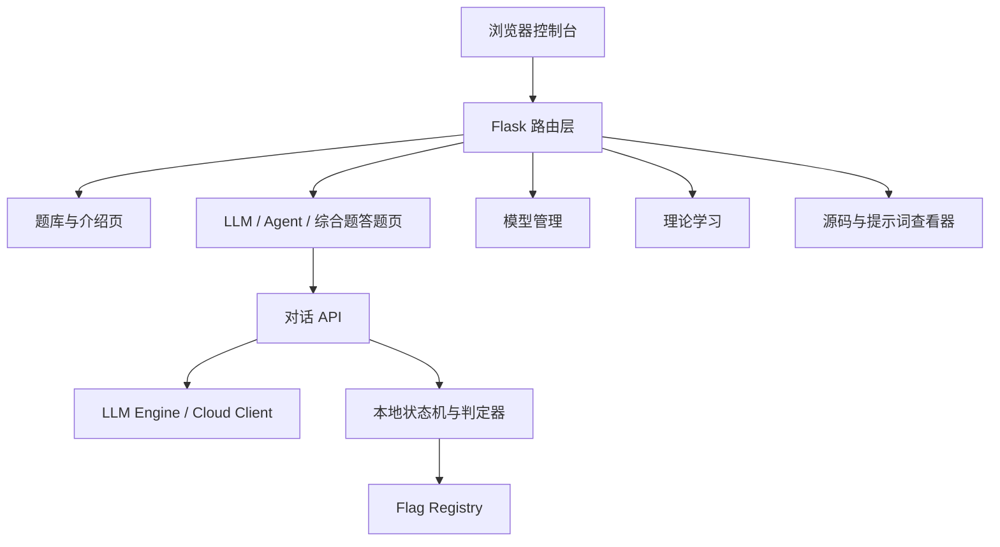

<div align="center">
  <h1>DVLAA</h1>
  <p><strong>Damn Vulnerable LLM and Agent Application</strong></p>
  <p>DVLAA 是面向大模型与智能体应用安全测试、教学演练和防护验证的本地化靶场平台。项目以 OWASP LLM Top 10 与 Agent 应用安全 Top 10 风险体系为主线，覆盖提示词注入、敏感信息泄露、RAG 投毒、工具滥用、权限边界、记忆污染、输出处理与资源消耗等典型场景，并提供真实模型交互、状态机判定、Flag 验证、源码查看、模型管理、双语界面、深浅色主题和 Docker 部署能力。</p>

  <p><strong>中文</strong> · <a href="README_EN.md">English</a></p>

  <p>
    
    
    
    
    
    
    
  </p>

  <p>
    <a href="#项目介绍">项目介绍</a> ·
    <a href="#核心特性">核心特性</a> ·
    <a href="#系统截图">系统截图</a> ·
    <a href="#系统架构">系统架构</a> ·
    <a href="#题库矩阵">题库矩阵</a> ·
    <a href="#快速开始">快速开始</a> ·
    <a href="#访问入口">访问入口</a>
  </p>
</div>

---

## 项目介绍

DVLAA 是一个本地化的大模型与智能体应用安全训练平台。系统以 Flask 控制台为入口，把 **OWASP LLM Top 10**、**Agent 应用安全 Top 10** 与综合攻防题统一到同一套交互、判定、Flag、源码查看和模型管理流程中，并提供深色/亮色主题与中英文界面切换。

平台围绕“漏洞介绍 → 答题页面 → 模型/状态机交互 → 审计面板 → Flag 验证 → WP 题解”构建完整训练闭环。LLM 题目强调提示词、上下文、RAG、输出处理、工具调用和资源消耗等风险；Agent 题目强调目标劫持、工具滥用、身份权限、供应链、代码执行、记忆污染、多智能体通信、级联故障、人机信任与失控智能体。

综合攻防题已按漏洞类型归入对应 LLM Top 10 入口，便于从漏洞原理进入案例化任务，再进入具体答题页面完成验证。

---


## 核心特性

- **理论先行的入口结构**：LLM Top 10 与 Agent Top 10 侧边栏入口均先进入漏洞风险介绍页，再进入答题页面。
- **43 道本地题目**：24 道 OWASP LLM 子题、10 道 Agent 场景、9 道综合攻防题。
- **真实交互式 Payload 验证**：题目通过模型响应、工具调用、状态机、知识库同步或多轮上下文推进，不依赖前端硬规则。
- **统一答题页风格**：LLM、Agent、综合题使用统一的事件背景、任务目标、同类题导航、终端交互和 Flag 验证布局。
- **在线训练转接**：在线 AI 安全训练入口已接入 Prompt Airlines，提供五关中文题面导引与系统内转接真实交互。
- **源码与提示词查看器**：题目页可查看系统提示词、运行配置与核心实现，运行时随机 Flag 会被占位符替换。
- **模型管理后台**：支持本地模型、Ollama、硅基流动和 OpenAI-Compatible 配置，API Key 掩码展示。
- **双语与主题切换**：顶部导航栏提供深色/亮色主题切换和中英文切换，偏好会保存在浏览器本地。
- **本地运行与 Docker 部署**：支持直接 Python 运行，也支持 Docker 镜像部署到独立容器。
- **运行期数据隔离**：模型配置、上传资料和下载模型保存在运行期目录或 Docker 数据卷中。

---

## 系统截图

<table>
  <tr>
    <td width="50%" align="center">
      <strong>靶场仪表盘</strong><br>
      
      <br><sub>集中展示靶场服务状态、当前模型、运行架构、题目总量、通关进度与漏洞矩阵入口。</sub>
    </td>
    <td width="50%" align="center">
      <strong>LLM 漏洞介绍页</strong><br>
      
      <br><sub>进入 OWASP LLM Top 10 后先阅读漏洞定义、攻击面、风险边界和本地题目映射，再进入答题页面。</sub>
    </td>
  </tr>
  <tr>
    <td width="50%" align="center">
      <strong>LLM 答题页面</strong><br>
      
      <br><sub>统一展示事件背景、任务目标、同类子题导航、Flag 提交位、交互终端、WP 题解与源码查看入口。</sub>
    </td>
    <td width="50%" align="center">
      <strong>Agent 答题页面</strong><br>
      
      <br><sub>Agent 场景与 LLM 题目保持一致布局，内置三阶段攻击链进度、工具清单、审计面板和状态机验证。</sub>
    </td>
  </tr>
  <tr>
    <td width="50%" align="center">
      <strong>LLM 模型管理</strong><br>
      
      <br><sub>管理本地模型、Ollama、硅基流动与 OpenAI-Compatible 服务，支持连接测试、切换当前模型和密钥掩码展示。</sub>
    </td>
    <td width="50%" align="center">
      <strong>理论学习</strong><br>
      
      <br><sub>提供内置中文学习资料、Markdown/PDF 上传、在线阅读和资料分类管理。</sub>
    </td>
  </tr>
</table>

---

## 系统架构



DVLAA 采用单体 Flask 应用组织运行时能力：

1. **Web UI 层**：`dvlaa/web/` 提供控制台、题库矩阵、介绍页、答题页、模型管理和学习页面。
2. **题目编排层**：`dvlaa/config.py` 与 `dvlaa/content/` 维护题库配置、场景任务、Payload 和题解。
3. **判定层**：`dvlaa/modules/llm*_judge.py` 与 `dvlaa/challenges/` 共同完成模型响应审查、状态校验和 Flag 判定。
4. **模型层**：`dvlaa/llm_engine.py`、`dvlaa/llm_client.py`、`dvlaa/modules/modelsel.py` 统一本地模型、Ollama、硅基流动和兼容 OpenAI API 的调用。
5. **运行数据层**：`dvlaa/flags.json` 保存题目定义，项目根目录的 `data/`、`uploads/` 保存运行期配置、模型、学习资料和上传文件。

---

## 题库矩阵

| 模块 | 数量 | 训练重点 |
| --- | ---: | --- |
| OWASP LLM Top 10 | 24 | 提示词注入、敏感信息泄露、供应链、投毒、输出处理、过度代理、系统提示词泄露、向量检索弱点、幻觉、资源消耗 |
| Agent 应用安全 Top 10 | 10 | 目标劫持、工具滥用、身份权限、供应链、代码执行、记忆污染、Agent 通信、级联故障、人机信任、失控智能体 |
| 综合攻防题 | 9 | 提示词覆盖、系统提示词提取、RAG 投毒、上下文替换、多轮升级、角色漂移、策略投毒、链式利用、数据边界侵蚀 |
| 在线 AI 安全训练 | 3 个入口 | Prompt Airlines 中文挑战转接、提示词防护闯关、提示词红队挑战平台 |

---


## 快速开始

### 环境要求

- Python 3.11+
- Docker 24.0+（推荐）
- 最低 4GB 内存，推荐 8GB+
- 可选：Ollama、本地 HuggingFace 模型或云端兼容 OpenAI API 的模型服务

### 方式一：一键 Docker 部署（推荐）

```bash
git clone https://github.com/Tcotl/DVLAA.git
cd DVLAA

./install.sh
```

安装脚本会自动构建镜像、重建 `dvlaa-console` 容器、挂载 `dvlaa-data` 数据卷，并等待 `/health` 健康检查通过。

常用自定义参数：

```bash
DVLAA_PORT=5081 DVLAA_IMAGE=dvlaa-lab:latest ./install.sh
```

### 方式二：手动 Docker 部署

```bash
docker build -t dvlaa-lab:latest .
docker run -d --name dvlaa-console \
  --restart unless-stopped \
  -p 5080:5000 \
  -v dvlaa-data:/app/data \
  dvlaa-lab:latest

curl http://127.0.0.1:5080/health
```

启用硅基流动：

```bash
docker run -d --name dvlaa-console \
  --restart unless-stopped \
  -p 5080:5000 \
  -v dvlaa-data:/app/data \
  -e SILICONFLOW_API_KEY=TOKEN \
  dvlaa-lab:latest
```

启用宿主机 Ollama：

```bash
docker run -d --name dvlaa-console \
  --restart unless-stopped \
  -p 5080:5000 \
  -v dvlaa-data:/app/data \
  -e OLLAMA_BASE_URL=http://host.docker.internal:11434/v1 \
  dvlaa-lab:latest
```

### 方式三：本地运行

```bash
git clone https://github.com/Tcotl/DVLAA.git
cd DVLAA

python3 -m venv .venv
source .venv/bin/activate
pip install -r requirements.txt
python -m dvlaa
```

仍可使用 `python app.py` 作为旧部署脚本的兼容入口。

---

## 模型配置

进入控制台后打开 **LLM 模型管理**：

1. 使用默认本地模型槽位，按页面提示部署本地模型。
2. 使用硅基流动配置，填写 API Key 后测试连接。
3. 使用 Ollama 本地服务，确认 `OLLAMA_BASE_URL` 指向宿主机服务。
4. 使用 OpenAI-Compatible 新增自定义服务。

运行期模型配置保存在 `data/` 或 Docker 数据卷中，页面只展示掩码后的密钥。

---

## 访问入口

- **靶场首页**：http://localhost:5080/
- **LLM Top 10 入口**：http://localhost:5080/challenge/1
- **Agent Top 10 入口**：http://localhost:5080/agent/1
- **模型管理**：http://localhost:5080/models
- **理论学习**：http://localhost:5080/learning
- **互联网 AI 靶场导航**：http://localhost:5080/internet-ranges
- **Prompt Airlines 中文训练**：http://localhost:5080/internet-ranges/promptairlines

---

## 功能矩阵

| 能力域 | 核心内容 | 入口 |
| --- | --- | --- |
| LLM 漏洞训练 | OWASP LLM Top 10 理论介绍、子题答题、WP、源码查看 | `/challenge/<level>` |
| Agent 场景训练 | Agent 应用安全 Top 10 理论介绍、工具链状态机、审计轨迹 | `/agent/<id>` |
| 综合攻防题 | 按漏洞类型归档到 LLM Top 10 的多阶段综合题 | `/challenge/<level>` |
| 在线 AI 安全训练 | Prompt Airlines 中文题面、系统内转接交互、外部靶场导航 | `/internet-ranges` |
| 模型管理 | 本地模型、Ollama、硅基流动、自定义 OpenAI-Compatible 配置 | `/models` |
| 理论学习 | 内置中文资料、Markdown/PDF 上传与阅读 | `/learning` |
| 源码查看 | 系统提示词、运行配置、核心实现、Flag 占位展示 | 答题页按钮 |
| Flag 验证 | 独立题目提交位、浏览器会话进度统计 | 各答题页 |
