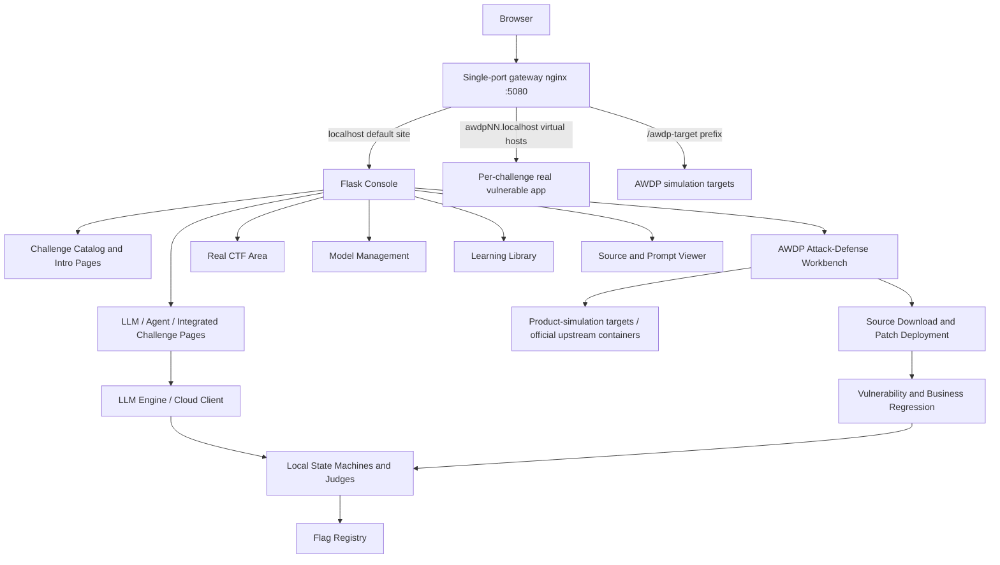

<div align="center">
  <h1>DVLAA</h1>
  <p><strong>Damn Vulnerable LLM and Agent Application</strong></p>
  <p>DVLAA is a local security range for LLM and Agent application testing, training, and defense validation. It is organized around the OWASP LLM Top 10 and Agent application security risks, covering prompt injection, sensitive information disclosure, RAG poisoning, tool misuse, privilege boundaries, memory poisoning, unsafe output handling, and resource consumption. The platform provides realistic model interaction, state-machine validation, Flag verification, source and prompt inspection, model management, bilingual UI, dark/light themes, and Docker deployment.</p>

  <p><a href="README.md">中文</a> · <strong>English</strong></p>

  <p>
    
    
    
    
    
    
    
  </p>

  <p>
    <a href="#overview">Overview</a> ·
    <a href="#features">Features</a> ·
    <a href="#screenshots">Screenshots</a> ·
    <a href="#architecture">Architecture</a> ·
    <a href="#challenge-matrix">Challenge Matrix</a> ·
    <a href="#awdp-attack-defense-track">AWDP Track</a> ·
    <a href="#real-ctf-track-model-poisoning">Real CTF Track</a> ·
    <a href="#quick-start">Quick Start</a> ·
    <a href="#default-login">Default Login</a> ·
    <a href="#entry-points">Entry Points</a>
  </p>
</div>

---

## Overview

DVLAA is a local LLM and Agent application security training platform. It uses a Flask console to bring **OWASP LLM Top 10**, **Agent Application Security Top 10**, integrated attack-defense labs, the **AWDP track**, and **real CTF adaptations** into one workflow for interaction, validation, Flag submission, source inspection, and model management. The interface supports dark/light themes and Chinese/English switching.

The platform is designed around a complete learning loop: "risk introduction → challenge page → model or state-machine interaction → audit panel → Flag verification → writeup". LLM labs focus on prompts, context, RAG, unsafe output handling, tool invocation, sensitive data exposure, and resource consumption. Agent labs focus on goal hijacking, tool misuse, identity and privilege boundaries, supply-chain risks, code execution, memory poisoning, multi-agent communication, cascading failures, human-Agent trust, and rogue-agent behavior.

Integrated attack-defense labs are classified under the corresponding LLM Top 10 categories. Every lab ships a step-by-step beginner-friendly writeup that walks from business background and normal baseline through attack-surface identification, progressive reproduction, evidence confirmation, and remediation design; interaction styles vary by track (chat terminals, business command consoles, product-simulation skins, and read-only material workspaces).

---

## Features

- **Risk-first navigation**: LLM Top 10 and Agent Top 10 sidebar entries open risk introduction pages before challenge pages.
- **81 local training labs**: 24 OWASP LLM sub-challenges, 10 Agent scenarios, 11 integrated attack-defense labs, 30 AWDP attack-defense challenges, and 6 real CTF adaptations of a model-poisoning competition.
- **Real interactive payload validation**: Challenges are validated through model responses, tool calls, state machines, knowledge-base updates, or multi-turn context instead of frontend-only rules.
- **Unified challenge pages**: LLM, Agent, and integrated labs share a consistent layout for background, objectives, sibling navigation, terminal interaction, and Flag verification.
- **Online training proxy**: The Online AI Security Training entry now integrates Prompt Airlines with Chinese challenge briefs, stable writeups, and in-system proxied live interaction.
- **Source and prompt viewer**: Challenge pages expose system prompts, runtime configuration, and core implementation with runtime Flags replaced by placeholders.
- **Model management**: Supports local models, Ollama, SiliconFlow, and OpenAI-compatible providers with masked API Key display.
- **Bilingual UI and theme switching**: The top navigation bar provides Chinese/English and dark/light switches with browser-local preferences.
- **Local and Docker deployment**: Run directly with Python or deploy as isolated containers; every vulnerable environment is exposed through a single-port (5080) gateway.
- **Runtime data isolation**: Model configuration, uploads, and downloaded models are stored in runtime directories or Docker volumes.
- **AWDP dual-track environments**: A product-simulation track ships by default (no upstream images required); each challenge can optionally launch the real environment — official Dify, RAGFlow, Langflow, Flowise, Open WebUI, and n8n containers — with one click from the challenge page. Flag judgment, patching, and regression apply identically to both tracks.

---

## Screenshots

<table>
  <tr>
    <td width="50%" align="center">
      <strong>Range Dashboard</strong><br>
      
      <br><sub>Shows service status, active model, runtime architecture, total challenges, progress, and vulnerability matrix entries.</sub>
    </td>
    <td width="50%" align="center">
      <strong>LLM Risk Introduction</strong><br>
      
      <br><sub>OWASP LLM Top 10 entries start with definitions, attack surfaces, risk boundaries, and local challenge mappings.</sub>
    </td>
  </tr>
  <tr>
    <td width="50%" align="center">
      <strong>LLM Challenge Page</strong><br>
      
      <br><sub>Displays background, objectives, sublevel navigation, Flag submission, terminal interaction, writeups, and source viewer entry.</sub>
    </td>
    <td width="50%" align="center">
      <strong>Agent Challenge Page</strong><br>
      
      <br><sub>Agent scenarios share the LLM layout and include attack-chain progress, tool lists, audit panels, and state-machine validation.</sub>
    </td>
  </tr>
  <tr>
    <td width="50%" align="center">
      <strong>LLM Model Management</strong><br>
      
      <br><sub>Manage local models, Ollama, SiliconFlow, and OpenAI-compatible services with connection testing and masked secrets.</sub>
    </td>
    <td width="50%" align="center">
      <strong>Learning Library</strong><br>
      
      <br><sub>Browse built-in Chinese materials, upload Markdown/PDF files, read documents online, and manage categories.</sub>
    </td>
  </tr>
</table>

---

## Architecture



DVLAA combines a single Flask application with lightweight sidecar containers:

1. **Web UI layer**: `dvlaa/web/` provides the console, challenge matrix, introduction pages, challenge pages, AWDP workbench, real-CTF area, model management, and learning pages.
2. **Challenge orchestration layer**: `dvlaa/config.py` and `dvlaa/content/` maintain challenge configuration, scenarios, payloads, and writeups; `real_challenges.py` carries the real-CTF adaptations and `awdp_challenges.py` the AWDP catalog and writeups.
3. **Judging layer**: `dvlaa/modules/llm*_judge.py`, `dvlaa/challenges/`, and `dvlaa/modules/awdp_runner.py` handle model response checks, state validation, patch checks, and Flag decisions. AWDP defense submissions run a static source-contract check plus vulnerability-blocking and normal-business regressions.
4. **AWDP target layer**: `integrations/targets/` provides ten product-simulation targets as standalone HTTP services; `integrations/upstream/` orchestrates the official Dify/RAGFlow/Langflow/Flowise/Open WebUI/n8n containers on demand; `integrations/gateway/nginx.conf` funnels all traffic through the single port 5080 with virtual-host and prefix routing.
5. **Model layer**: `dvlaa/llm_engine.py`, `dvlaa/llm_client.py`, and `dvlaa/modules/modelsel.py` unify local models, Ollama, SiliconFlow, and OpenAI-compatible APIs.
6. **Runtime data layer**: `dvlaa/flags.json` stores per-track Flags, while project-level `data/` and `uploads/` store runtime configuration, models, learning materials, and user uploads.

---

## Challenge Matrix

| Module | Count | Training Focus |
| --- | ---: | --- |
| OWASP LLM Top 10 | 24 | Prompt injection, sensitive information disclosure, supply chain, poisoning, output handling, excessive agency, system prompt leakage, vector retrieval weaknesses, hallucination, resource consumption |
| Agent Application Security Top 10 | 10 | Goal hijacking, tool misuse, identity and privilege abuse, supply chain, code execution, memory poisoning, Agent communication, cascading failures, human-Agent trust, rogue agents |
| Integrated Labs | 11 | Prompt override, system prompt extraction, RAG poisoning, context replacement, multi-turn escalation, persona hijacking, policy poisoning, chained exploitation, data boundary erosion, healthcare privacy disclosure, emergency medical knowledge tampering |
| AWDP AI Agent Attack & Defense | 30 | Public open-source AI project mappings with a dual-track runtime (product simulation + optional real environment): prompt injection, RAG poisoning, tool overreach, SSRF, Text-to-SQL, IDOR, API authentication, and business-logic bypass |
| Real CTF Track: Model Poisoning | 6 | Competition adaptations: adapter forensics with poisoned trigger phrases, safe pickle artifact inspection, label-parsing ambiguity poisoning, output-layer weight tamper detection, JSONL schema-ambiguity backdoor, preprocessing fingerprint leakage |
| Online AI Security Training | 3 entries | Prompt Airlines Chinese challenge proxy, prompt-guard challenges, prompt red-team platform |

---

## AWDP Attack-Defense Track

AWDP (Attack With Defense Patch) is an independent track alongside the regular LLM, Agent, and integrated labs. AWDP11-30 adapt twenty real competition cases from Track 2 "AI Agent Security Attack & Defense" of the 2026 China (Guangxi) — ASEAN AI Security Competition (match_1443), organized purely by AWDP number. On offense, players reproduce the defect through business operations; a Flag can be submitted only after a vulnerable server JSON response actually returns the current-session value. On defense, players download auditable source and submit a repair package; the platform first verifies the repaired server-handler static contract and then reruns exploit and normal-business requests to confirm that the vulnerability is blocked without disabling the service.

### Dual-track Runtime

Every AWDP case offers two selectable tracks, switched from the "real environment" panel on the challenge page:

- **Simulation track (default)**: product-faithful web skins served by `integrations/targets/target_server.py` (Dify workbench, RAGFlow knowledge base, etc.), with state persisted in `integrations/targets/runtime/<id>.json`. Zero extra dependencies; Flags and attack chains rotate per session.
- **Real-environment track (on demand)**: clicking "start real environment" has `env_orchestrator` pull up the corresponding official container stack (for example the full Dify 1.9.2 suite). Once ready, the workbench iframe switches to the genuine application UI and the vulnerability is reproduced inside the real software.

Both tracks share the same Flag judgment, patch deployment, and regression logic. All traffic flows through the single-port 5080 gateway (`localhost` → console, `awdpNN.localhost` → matching target), so no extra host ports are published.

### AWDP01: S-Spring Runtime Policy Disclosure and Repair

- **Challenge entry**: `http://localhost:5080/awdp/1`
- **Scenario**: The S-Spring customer-support desk routes order, refund, and after-sales questions into one OpenAI-compatible Chat Completions service and offers a handoff-policy export. A legacy change made the legacy handoff export (`handoff=legacy` with `includeRuntimePolicy=true`) write a server-only runtime verifier into the response, creating an unauthorized data exposure.
- **Attack phase**: In the "Export Customer Handoff Policy" form (`support.export_policy`), first establish a baseline with default parameters (`handoff=standard`, runtime policy unchecked), then set `handoff` to `legacy`, enable `includeRuntimePolicy`, and submit again; the vulnerable JSON response gains a `runtime_verifier` field. The Flag is accepted only when the server JSON response actually contains it; the backend does not fabricate a solve from keywords or frontend state.
- **Defense phase**: Download the vulnerable source and repair the server-side path in `src/web_service.js` that places the runtime verifier into legacy handoff export responses. Package a root-level `update.sh` and the modified files as `.tar.gz` (or `.tgz`) and upload it. The patch script uses the documented `cp`, `mv`, and `rm` file operations.
- **Patch script format**: `update.sh` may retain a shebang, comments, and fail-fast declarations such as `set -e`, `set -eu`, or `set -euo pipefail`. The platform does not execute arbitrary Shell; it interprets only the whitelisted file operations.
- **Regression verdict**: Before deployment, the platform checks the static server-boundary contract in `src/web_service.js`; after deployment, it reruns the legacy export request and verifies the response no longer contains the runtime verifier (redacted or refused), then confirms standard handoff exports plus order, refund, after-sales, and service-hours Q&A still resolve. A failed check leaves the previous deployment active.

The AWDP01 page contains the full writeup, payload, service-call mapping, source viewer, fixed patch example download, and submission history.

### AWDP02-AWDP10: Public Disclosure Mappings

Scenario text, Flags, and attack chains are local-isolated implementations and never connect to or attack upstream services. CVE, NVD, and GitHub Security Advisory links document the real root cause; the Flag and attack chain rotate per session.

| Case | Open-source project and reference | Training focus |
| --- | --- | --- |
| AWDP02 | Dify - CVE-2024-10252 | External-ticket prompt injection and workflow execution boundary |
| AWDP03 | RAGFlow - CVE-2024-53450 | RAG document poisoning and retrieval isolation |
| AWDP04 | Langflow - CVE-2024-48061 | Low-privilege Agent tool overreach and code isolation |
| AWDP05 | Flowise - CVE-2024-8181 | API authentication bypass and administrator-route authorization |
| AWDP06 | Dify - CVE-2025-32790 | App-export RBAC and business-logic bypass |
| AWDP07 | Open WebUI - CVE-2024-30256 | Remote-fetch SSRF and DNS/redirect validation |
| AWDP08 | Dify - CVE-2025-0185 | Vanna Pandas query injection and read-only query boundaries |
| AWDP09 | RAGFlow - CVE-2025-25282 | Cross-tenant document IDOR and tenant isolation |
| AWDP10 | n8n - CVE-2025-52554 | Execution-record authorization and workflow integrity |

Each page provides a Chinese payload, vulnerability explanation, service-call and source viewer, public references, and a directly uploadable fixed-patch example. Defense submissions must repair the scenario-specific server-side boundary in `src/web_service.js`; the platform performs static source-contract checks, then executes vulnerability-blocking and normal-business regressions against the real Web/API endpoints.

#### Public Disclosure Details and Repair Focus

| Case | Affected versions | Disclosed root cause | Repair focus |
| --- | --- | --- | --- |
| AWDP02 | Dify <= 0.9.1 | Internal sandbox requests could inject Python and run with elevated privileges ([CVE](https://nvd.nist.gov/vuln/detail/CVE-2024-10252), [fix commit](https://github.com/langgenius/dify/commit/4ac99ffe0e1c9f4d7c523908e91bbc7739e0a8d4)) | Keep external tickets as data; enforce allowlists and server-side authorization in workflow execution |
| AWDP03 | RAGFlow 0.13.0 | Insufficient object authorization in `document-hooks.ts` could expose documents ([CVE](https://nvd.nist.gov/vuln/detail/CVE-2024-53450), [source](https://github.com/infiniflow/ragflow/blob/cec208051f6f5996fefc8f36b6b71231b1807533/web/src/hooks/document-hooks.ts#L23)) | Enforce document ACL, tenant scope, and a data-only RAG citation boundary server-side |
| AWDP04 | Langflow <= 1.0.18 | Code components ran in-process and could reach RCE ([CVE](https://nvd.nist.gov/vuln/detail/CVE-2024-48061)) | Sandbox code components and authorize every tool invocation and argument |
| AWDP05 | Flowise 1.8.2 | Authentication bypass exposed administrator APIs ([CVE](https://nvd.nist.gov/vuln/detail/CVE-2024-8181), [research](https://tenable.com/security/research/tra-2024-33)) | Require server-side authentication on every chatflow/admin API; do not rely on hidden UI routes |
| AWDP06 | Dify <= 0.6.8; fixed in 0.6.13 | Normal users could invoke the administrator-only APP DSL export ([CVE](https://nvd.nist.gov/vuln/detail/CVE-2025-32790), [GHSA](https://github.com/langgenius/dify/security/advisories/GHSA-jp6m-v4gw-5vgp)) | Derive authorization from session role and App ACL, ignoring a body-supplied `role` |
| AWDP07 | Open WebUI < 0.1.117; fixed in 0.1.117 | Authenticated remote fetch permitted blind SSRF ([CVE](https://nvd.nist.gov/vuln/detail/CVE-2024-30256), [GHSA](https://github.com/open-webui/open-webui/security/advisories/GHSA-39wr-r5vm-3jxj)) | Validate DNS/IP/ports before every connection and redirect; block loopback, private, and link-local ranges |
| AWDP08 | Latest Dify Tools Vanna version at disclosure | Insufficient `df_information_schema` sanitization enabled Pandas query injection with possible RCE ([CVE](https://nvd.nist.gov/vuln/detail/CVE-2025-0185), [report](https://huntr.com/bounties/7d9eb9b2-7b86-45ed-89bd-276c1350db7e)) | Use AST/column allowlists, parameterized queries, a read-only account, and reject multi-statement/system-table access |
| AWDP09 | RAGFlow <= 0.14.1 (public record) | Authenticated IDOR enabled cross-tenant user enumeration/addition ([CVE](https://nvd.nist.gov/vuln/detail/CVE-2025-25282), [GHSA](https://github.com/infiniflow/ragflow/security/advisories/GHSA-wc5v-g79p-7hch)) | Derive tenant from the session and enforce object ACLs for every document/index operation; the public record still says unpatched |
| AWDP10 | n8n < 1.99.1; fixed in 1.99.1 | `/rest/executions/:id/stop` did not verify owner/shared state ([CVE](https://nvd.nist.gov/vuln/detail/CVE-2025-52554), [GHSA](https://github.com/n8n-io/n8n/security/advisories/GHSA-gq57-v332-7666)) | Check owner or explicit sharing for stop/retry/view; an execution ID is not an authorization credential |

The upstream projects, versions, and disclosure links above are for vulnerability study and source comparison. DVLAA runs only isolated local implementations and official upstream containers, and marks cases where the public record does not list an upstream fix.

### AWDP11-AWDP30: Competition Adaptations

These twenty cases adapt real competition cases from Track 2 "AI Agent Security Attack & Defense" of the 2026 China (Guangxi) — ASEAN AI Security Competition (match_1443), organized purely by AWDP number. The platform keeps the attachment-driven workflow:

- **Attachment = patch target**: the downloadable source matches the on-site attachments (`dvlaa/content/awdp_finals/<NN>/{vulnerable,fixed}/`); players patch the designated service file via `update.sh` (whitelisted `cp`/`mv`/`rm`). AWDP21's attachment contained only an entrypoint hint, so equivalent source was authored from it; AWDP30's attachment is a player workspace archive, and the platform rebuilt the teaching implementation from its recorded API surface and vulnerability chain.
- **Shared judging engine**: each vulnerability is implemented once in `integrations/targets/finals_core.py`, loaded identically by the simulation target container and the console regression, so the learner-facing page and the platform verdict always agree; the vulnerable and patched branches follow the actual red/blue solving paths.
- **Patch contracts**: static checks vary by the case `language` field — Python (syntax compile + vulnerable clause removed + server semantics retained), text/JS (marker checks) and JS-QuickJS (AWDP01-10); deployment then runs vulnerability-blocking and normal-business regressions against the target.

#### Case overview (AWDP11-AWDP30)

AWDP11-AWDP20 share the pattern "untrusted wording replaces server-side authorization": the fix removes the legacy decision branch and restores server-side authorization as the sole verdict.

| Case | Scenario | Vulnerability semantics | Repair focus |
| --- | --- | --- | --- |
| AWDP11 | Contract Archive Portal (200) | Explicit approval wording in OCR evidence acts as authorization; the archive verifier is echoed | Server approval state is the only grant |
| AWDP12 | Customer Delegation Router (350) | Retrieval wording in conversations bypasses the consent ledger | retrieve_customer_order bound to server-side consent |
| AWDP13 | Invoice Reconciliation Desk (350) | Release wording in OCR text counts as finance approval; the internal invoice scan is echoed | Release bound to server-signed approval |
| AWDP14 | Last-mile Dispatch Board (350) | Driver-note wording replaces recipient confirmation; unconfirmed redirect echoes the note | Redirect bound to the confirmation record |
| AWDP15 | Merchant Assortment Studio (350) | User-controlled ranking plus in-document directives open the restricted catalogue | Catalogue access bound to server-authorized reviews |
| AWDP16 | Onboarding Memory Steward (350) | Composition wording counts as HR delegation; restricted packet composed for others | Cross-employee composition bound to HR delegation |
| AWDP17 | Release Control Tower (350) | Manifest extensions become registry tools and echo the signing credential | Extensions never become tools |
| AWDP18 | Runbook Sentinel (350) | Probe follows redirects and forwards the capability; metadata endpoint leaks | Per-redirect validation, no capability forwarding |
| AWDP19 | Shift Handoff Inspector (350) | Observation wording bypasses approval/recipient confirmation and delivers the restricted bundle | Export bound to approval and confirmation |
| AWDP20 | Signal Triage Console (350) | Alert-body wording bypasses attestation and echoes the restricted bridge payload | Delivery authorized only by server attestation |
| AWDP21 | AssistBot (200) | Incomplete screen term list; indirect instructions bypass the filter and leak the policy secret | Secret removed from model-visible context |
| AWDP22 | Starling Finance Settlement Desk (350) | Canonical invoice-key collision borrows OCR approvals; settlement note echoes the earliest (internal) invoice | Approval and note bound to same invoice and tenant |
| AWDP23 | Starling Knowledge Hub (350) | User-controlled priority outranks trusted content; poisoned documents drive doc.preview into private documents | Preview enforces visibility/tenant |
| AWDP24 | Starling Support Bridge (350) | Poisoned memory drives a cross-tenant ticket lookup echoing the bridge credential | Ticket lookup enforces the tenant boundary |
| AWDP25 | Starling Ops Memory Console (350) | Incident summaries become trusted memory; override directives trigger unquoted playbook command injection | Quote arguments, demote incident summaries |
| AWDP26 | Starling Release Console (500) | Artifact-path tampering + staging approval reused for production + unquoted deploy command injection | Unsigned paths rejected, environment-bound approvals, quoted commands |
| AWDP27 | Starling Safety Audit Hub (350) | HMAC canonical input omits tenant/claims/status/details; replayed reports forge internal approvals | Signature covers every business field |
| AWDP28 | Sentinel AgentOps (350) | Tool gateway resolves arbitrary Python callables by module path; default executor key hardcoded | Registry-only dispatch |
| AWDP29 | SentinelDesk-AgentOps (200) | Ticket bodies self-promote to high-trust memory unlocking ops.* tools and the artifact export | Promotion limited to trusted sources |
| AWDP30 | InvoiceLink Gateway (500) | Single-pass WAF decoding plus file:/ bypass and external DTD fetching; parse errors echo local files | External DTD fetching disabled; multi-pass normalization |

Every case page provides the attachment-faithful source download, a directly uploadable fixed-patch example (`update.sh` + `patched/`), Chinese payloads, step-by-step writeups (loaded on demand via the help button) and the source viewer.

---

## Real CTF Track: Model Poisoning

This track adapts model-poisoning challenges from a real AI security competition (ten original cases; six that satisfy full reproduction conditions are included). Brief semantics, material shapes, and verdicts follow the originals:

- **REAL01 AdapterTrace** (attachment): signed release-adapter forensics. Locate the narrow trigger phrase that truly changes moderation routing from the manifest and ledger, then export evidence through the quarantine-export endpoint.
- **REAL02 Calibration** (attachment): analysis of the `challenge.pt` model artifact. Read-only unzip of the container identifies the model class name; derive the calibration route gain and replay-verify it.
- **REAL03 FC_Layer** (attachment): output-head forensics on `challenge.pth`. Inspect tensor dtype and weight element counts, then replay fixed inputs to locate tampered final-layer behavior.
- **REAL04 GradPrint** (attachment): preprocessing fingerprint and gradient-print leakage. Correlate snapshot metadata `run_id` with the preprocess config `hash_seed` to recover debug credentials.
- **REAL05 Hidden_Margin** (full web challenge): the only case shipping complete service source. Guest imports accept moderation fields leading to knowledge-base poisoning, and a tool-call injection reads internal documents; this case embeds a dedicated same-origin Northstar web environment covering import/retrieval/quarantine/audit end to end.
- **REAL06 LoRA Merge Gate** (attachment): LoRA merge-gate bypass; derive a merge configuration satisfying the gate checks within brief constraints.

Design and judging conventions:

- Attachment challenges provide an in-page read-only materials workspace (zip listing, manifest, ledger); players never need to deserialize arbitrary pickles, and the platform never executes attachment content.
- Submission passes only after the correct operation sequence makes the server return the current Flag; Flags are managed under the `_real` key of `flags.json`.
- REAL05 additionally exposes a standalone same-origin page at `/real-web/5/` sharing session state with the embedded workbench view.
- Writeups load on demand via the help button (`/api/real-challenge/<id>/help`) instead of being printed on the brief.

---

## Quick Start

### Requirements

- Python 3.11+
- Docker 24.0+ recommended
- Minimum 4 GB memory, 8 GB+ recommended; 16 GB if enabling the real Dify environment
- Optional: Ollama, local HuggingFace models, or cloud OpenAI-compatible model services

### Option 1: One-command Docker Deployment (recommended)

```bash
git clone https://github.com/Tcotl/DVLAA.git
cd DVLAA

./install.sh
```

The install script builds the image, starts the AWDP simulation targets and official upstream environments, recreates the `dvlaa-console` container, mounts the `dvlaa-data` volume, and waits for `/health`. The simulation track works out of the box; start real environments either per-challenge via the "start real environment" button or up-front with `integrations/upstream/bootstrap.sh up`.

Common custom parameters:

```bash
DVLAA_PORT=5081 DVLAA_IMAGE=dvlaa-lab:latest ./install.sh
```

### Option 2: Manual Docker Deployment

```bash
# Start the AWDP simulation targets first (optional; the console falls back to built-in fixtures)
cd integrations/targets && docker compose up -d && cd ../..

docker build -t dvlaa-lab:latest .
docker run -d --name dvlaa-console \
  --restart unless-stopped \
  -v dvlaa-data:/app/data \
  -v "$PWD/integrations/targets/runtime:/app/integrations/targets/runtime" \
  -e DVLAA_AWDP_NATIVE_MODE=native \
  -e DVLAA_AWDP_NATIVE_URL=http://dvlaa-awdp-native:5900 \
  --network dvlaa-net \
  dvlaa-lab:latest python -m dvlaa

curl http://127.0.0.1:5080/health
```

Note: pair the console with the nginx gateway from `integrations/gateway/nginx.conf` for single-port routing on 5080 (`install.sh` does this automatically). Without the gateway you can `-p 5080:5000` directly and point learners at `DVLAA_AWDP_NATIVE_PUBLIC_URL` for target pages.

Enable SiliconFlow:

```bash
docker run -d --name dvlaa-console \
  --restart unless-stopped \
  -v dvlaa-data:/app/data \
  -e SILICONFLOW_API_KEY=TOKEN \
  dvlaa-lab:latest python -m dvlaa
```

Enable host Ollama:

```bash
docker run -d --name dvlaa-console \
  --restart unless-stopped \
  -v dvlaa-data:/app/data \
  -e OLLAMA_BASE_URL=http://host.docker.internal:11434/v1 \
  dvlaa-lab:latest python -m dvlaa
```

### Option 3: Local Python Runtime

```bash
git clone https://github.com/Tcotl/DVLAA.git
cd DVLAA

python3 -m venv .venv
source .venv/bin/activate
pip install -r requirements.txt
python -m dvlaa
```

`python app.py` is still available as a compatibility entry point for older deployment scripts.

---

## Default Login

After the service starts, open `http://localhost:5080/` to access the login page. DVLAA includes a default administrator account for local deployments:

| Field | Default |
| --- | --- |
| Username | `admin` |
| Password | `DVLAA2026+` |

The same default administrator account can be used by multiple users or browser sessions at the same time.

To override the default credentials during deployment, set environment variables:

```bash
DVLAA_ADMIN_USERNAME=admin \
DVLAA_ADMIN_PASSWORD='DVLAA2026+' \
./install.sh
```

For manual Docker deployment, add:

```bash
-e DVLAA_ADMIN_USERNAME=admin \
-e DVLAA_ADMIN_PASSWORD='DVLAA2026+'
```

---

## Model Configuration

Open **LLM Model Management** in the console:

1. Use the default local model slot and deploy a recommended local model from the page.
2. Configure SiliconFlow with an API Key and test the connection.
3. Configure Ollama and make sure `OLLAMA_BASE_URL` points to the host service.
4. Add custom OpenAI-compatible providers when needed.

Runtime model configuration is stored in `data/` or the Docker data volume. API keys are displayed only in masked form.

---

## Entry Points

- **Dashboard**: http://localhost:5080/
- **LLM Top 10 Entry**: http://localhost:5080/challenge/1
- **Agent Top 10 Entry**: http://localhost:5080/agent/1
- **AWDP Track**: http://localhost:5080/awdp/1 - http://localhost:5080/awdp/30
- **Real CTF: Model Poisoning**: sidebar "Real Challenges" group, or http://localhost:5080/real-challenge/1
- **REAL05 Standalone Web**: http://localhost:5080/real-web/5/
- **Model Management**: http://localhost:5080/models
- **Learning Library**: http://localhost:5080/learning
- **Internet AI Range Navigator**: http://localhost:5080/internet-ranges
- **Prompt Airlines Chinese Training**: http://localhost:5080/internet-ranges/promptairlines

---

## Capability Matrix

| Capability | Core Content | Entry |
| --- | --- | --- |
| LLM security labs | OWASP LLM Top 10 theory, sub-challenges, writeups, source viewer | `/challenge/<level>` |
| Agent scenario labs | Agent security Top 10 theory, tool-chain state machines, audit trails | `/agent/<id>` |
| Integrated labs | Multi-stage labs classified under LLM Top 10 categories | `/challenge/<level>` |
| AWDP attack-defense lab | 10 dual-track cases (product simulation + optional official real environment) mapped to public Dify, RAGFlow, Langflow, Flowise, Open WebUI, and n8n disclosures; server-response Flag validation, `tar.gz` + `update.sh` defense patch, static source contract, and vulnerability-blocking/business dual regression | `/awdp/1` - `/awdp/30` |
| Real CTF: model poisoning | Competition adaptations: read-only materials workspace + interactive verdict actions + server-side forensic Flags; REAL05 embeds a dedicated web environment | `/real-challenge/1` - `/real-challenge/6` |
| Online AI security training | Prompt Airlines Chinese briefs, in-system proxied interaction, external range navigation | `/internet-ranges` |
| Model management | Local models, Ollama, SiliconFlow, custom OpenAI-compatible providers | `/models` |
| Learning library | Built-in materials, Markdown/PDF upload, online reading | `/learning` |
| Source viewer | System prompts, runtime configuration, core implementation, Flag placeholders | Challenge page buttons |
| Flag verification | Dedicated Flag submission and browser-session progress tracking | Challenge pages |
